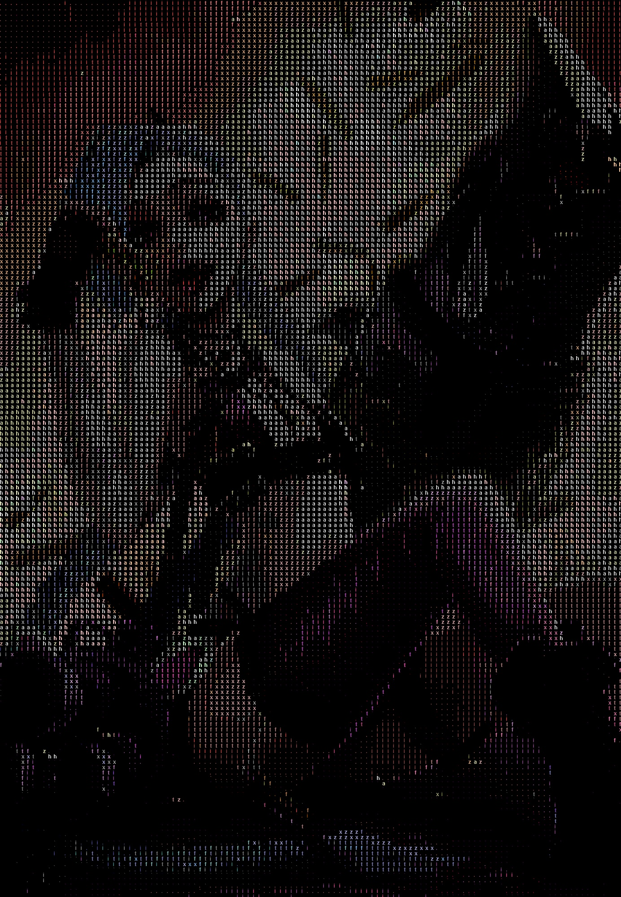

# ASCII art

Выполнил Малямов Иван группа МЕН-200201

Запускается скрипт main.py с аргументами -i [Путь до картинки] -p [Путь до результата]
По умолчанию будет взята картинка './images/example.jpg' вывод в './images/result_example.png'

Все настройки хранятся в ./'settings.json'

Размер изображения можно изменить командой -s [Ширина:Высота]

## Пример

### Вход

### Выход

